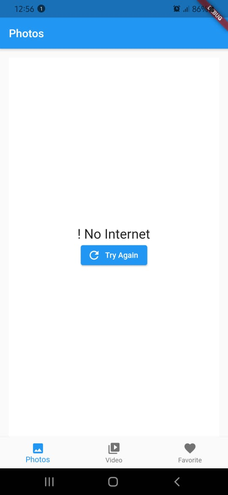
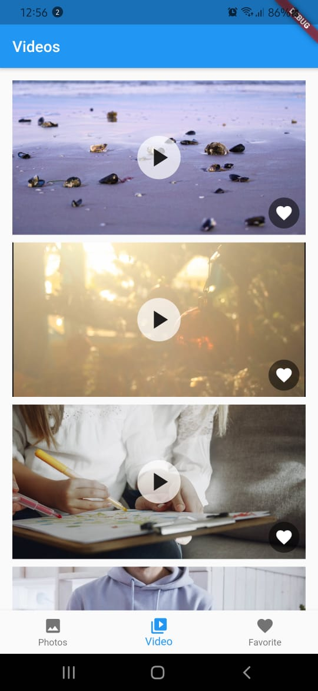
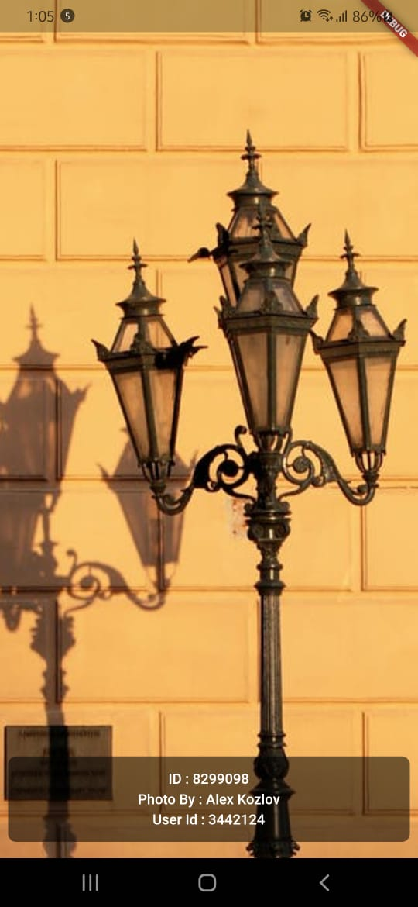
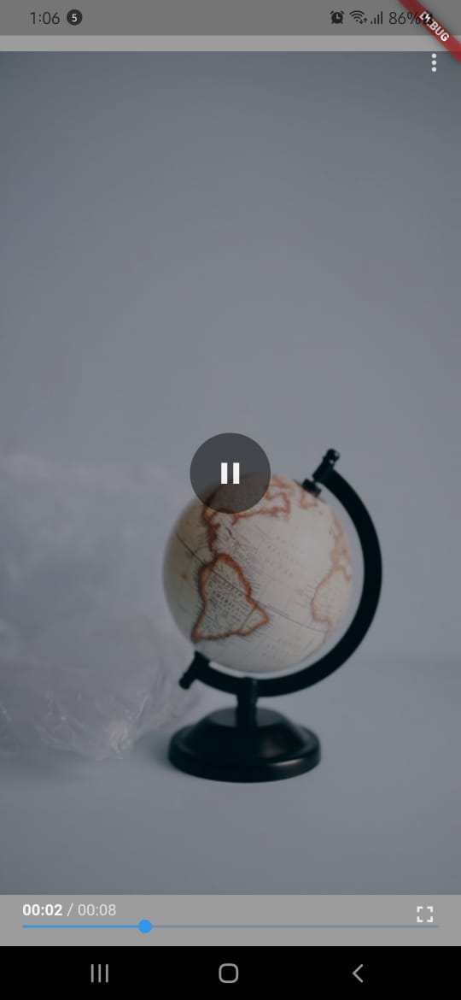
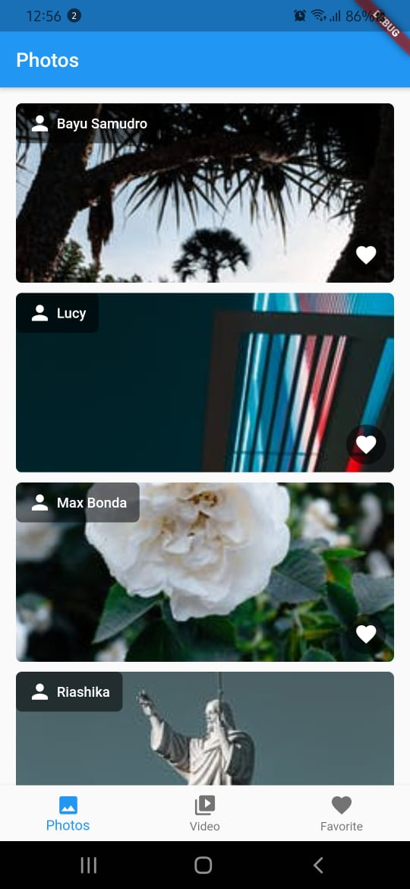
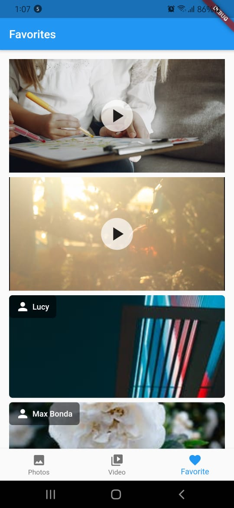
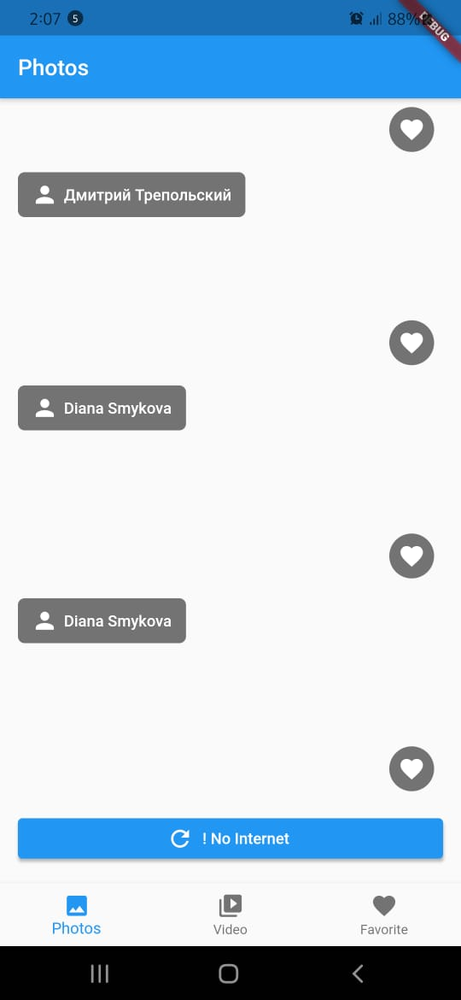

# Clean Code Test

A new Flutter project.

## Getting Started

This project is a starting point for a Flutter application.

## A
## 1. A few screenshots of the finished product

 2. A short explanation of App.
  
  This app fetches photos and videos from Pexel's APi in an Pagination form
  and once loaded a user can see the Image and its details by tapping on it and for videos a user can play video by tapping on video. A user can add or remove the Images and videos to favorites by tapping on fav button.

A few resources to get you started if this is your first Flutter project:

- [Lab: Write your first Flutter app](https://flutter.dev/docs/get-started/codelab)
- [Cookbook: Useful Flutter samples](https://flutter.dev/docs/cookbook)

For help getting started with Flutter, view our
[online documentation](https://flutter.dev/docs), which offers tutorials,
samples, guidance on mobile development, and a full API reference.
